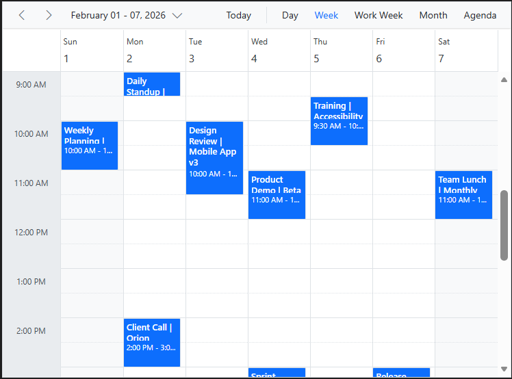

# Getting Started with Integrating Syncfusion Angular Scheduler in SharePoint (SPFx 1.22+)

## Description

This repository provides a complete example of how to integrate the Syncfusion Angular Scheduler component into a SharePoint Framework (SPFx) web part using the modern Heft-based build toolchain introduced in SPFx v1.22+. SharePoint Framework enables fully client‑side solutions that run seamlessly within SharePoint Online pages.

## Prerequisites

- Use Node Version >= 22 (supported by SPFx 1.22)
- A valid Microsoft 365 tenant

## Application Setup & Running the Project (Clone & Run)

1. **Clone the repository to your local machine and navigate to the project folder.**
   ```bash
   git clone <repository-url>
   cd <project-folder>
   ```

2. **Install project dependencies:**
   ```bash
   npm install
   ```

3. **Update Tenant Domain in `config/serve.json`:**
   ```json
   "initialPage": "https://<your-tenant>.sharepoint.com/_layouts/15/workbench.aspx"
   ```

4. **Trust the SPFx Dev Certificate:**
   ```bash
   npx trust-dev-cert
   ```
   Or simply trust when prompted during first run.

5. **Start the application:**
   ```bash
   npm run start
   ```

6. **Allow debug scripts?**  
   From the browser opened in step 5, allow debug scripts by clicking `Load debug scripts`.

7. **Viewing Syncfusion Schedule Component**
   - Click the + (Add a web part in column one) icon in the browser window (SharePoint).
   - Select 'App' from the options shown.
   - Finally, you can see the Syncfusion Angular Scheduler rendered in SharePoint.

## Build for Production

```bash
npm run build
```

The package will be created at: `sharepoint/solution/<project-name>.sppkg`

## Output Preview

**Syncfusion Angular Scheduler**



*Image illustrating the Syncfusion Angular Scheduler in SharePoint*